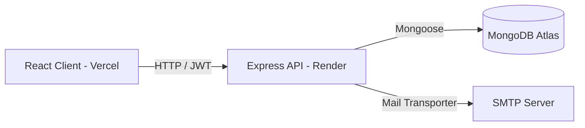

# ✦ Palette

[](file:///f:/palette/LICENSE)
[](https://nodejs.org)
[](https://github.com/Suchith2212/palette/actions)
[](https://react.dev)
[](https://www.typescriptlang.org)
[](https://expressjs.com)
[](https://www.mongodb.com)

Palette is the digital home of the **Fine Arts Club of IIT Gandhinagar**. It is a modern, responsive web application designed to showcase member submissions, host online digital art exhibitions, manage club workshops/competitions, and streamline artwork curation.

---

## 🚀 Features

- **🎨 Member Gallery & Submissions**: Registered artists can upload their drawings, paintings, and digital art with custom titles and descriptions.
- **👁️ Online E-Exhibitions**: Virtual galleries curated by admins, allowing visitors to browse themed exhibitions digitally.
- **📅 Club Event Management**: Create, edit, and categorize club activities into Workshops, Competitions, or standard Events. Members can apply/register directly through the portal.
- **🛡️ Curation Pipeline**: A robust admin review dashboard to evaluate, score, approve, or re-order artwork positions in the public showcase.
- **🔐 Secure Access Control**: JWT-based secure sessions, role-based authorization (`admin`/`user`), and a numeric OTP verification flow on email registration.
- **✨ Fluid User Experience**: Smooth route-change transitions powered by Framer Motion, skeletons for asynchronous loads, and custom animation loops.

---

## 🏛️ System Architecture

Palette is built as a Decoupled Single Page Application (SPA):
1. **Frontend (Vercel)**: React SPA styled with Bootstrap 5 and animated via Framer Motion.
2. **Backend (Render)**: REST API utilizing Node.js, Express, and Multer for media handling.
3. **Database (MongoDB Atlas)**: Document-oriented database cluster mapping objects via Mongoose schemas.
4. **Notification Layer (SMTP)**: Nodemailer integration dispatching validation codes to new members.



For a detailed breakdown, see the [Architecture Documentation](file:///f:/palette/docs/architecture.md).

---

## 📁 Repository Structure

The project is structured as a workspaces monorepo:

| Directory / File | Description |
| --- | --- |
| [`client/`](file:///f:/palette/client) | React SPA frontend source code (Vite + TypeScript) |
| [`server/`](file:///f:/palette/server) | Express API backend source code (TypeScript + Mongoose) |
| [`docs/`](file:///f:/palette/docs) | Detailed technical, API, and deployment documentation |
| [`.github/`](file:///f:/palette/.github) | Issue templates, PR templates, and GitHub Actions CI pipelines |
| [`package.json`](file:///f:/palette/package.json) | Workspace scripts and root dependency manager |
| [`.gitignore`](file:///f:/palette/.gitignore) | Git exclusion patterns |

---

## 🛠️ Technology Stack

- **Frontend**: React 19, TypeScript, Vite, Framer Motion, Bootstrap 5, Axios, React Icons, React Masonry CSS.
- **Backend**: Node.js, Express 5, TypeScript, Mongoose, Multer (multipart forms), Bcrypt.js (password hashing), Jsonwebtoken (sessions), Nodemailer (SMTP verification).
- **Hosting & Infrastructure**: Vercel (Client SPA), Render (API Server), MongoDB Atlas (Database), GitHub Actions (CI).

---

## 💻 Local Setup & Development

### 1. Prerequisites
- **Node.js** (v18 or higher)
- **MongoDB** running locally or a connection string to a remote database.

### 2. Installation
Install root development tools and project dependencies:
```bash
# Clone the repository
git clone https://github.com/Suchith2212/palette.git
cd palette

# Install dependencies across all workspaces
npm install
cd client && npm install
cd ../server && npm install
```

### 3. Local Environment Variables
- Copy the template in `server/.env.example` to `server/.env` and update your database and SMTP connection details.
- Copy `client/.env.example` to `client/.env` (no variables required locally as Vite dev server proxies request endpoints automatically).

### 4. Running the App
Run both servers concurrently from the workspace root:
```bash
# Start Client Dev Server
npm run dev:client

# Start Server API (in a separate terminal)
npm run dev:server
```
Visit `http://localhost:5173` to view the application.

For detailed command listings and how to run database seeders, check the [Local Development Guide](file:///f:/palette/docs/development.md).

---

## 🚢 Production Deployment

- **Frontend**: Deploy `client/` as a static SPA on Vercel with your backend endpoint set under `VITE_API_ORIGIN`.
- **Backend**: Deploy `server/` on Render or Railway, configuring appropriate environment credentials.

Refer to the [Production Deployment Guide](file:///f:/palette/docs/deployment.md) for step-by-step configurations.

---

## 🔌 API & Database Reference

The backend REST API covers Authentication, Artworks, Events, Exhibitions, and User profiles.

<details>
<summary><b>View API Endpoint Quick Reference</b></summary>

| Context | Endpoint | Method | Security | Description |
| --- | --- | --- | --- | --- |
| **Auth** | `/api/auth/register` | `POST` | Public | Register profile + photo upload |
| **Auth** | `/api/auth/verify-code` | `POST` | Public | Verify account via email OTP code |
| **Auth** | `/api/auth/login` | `POST` | Public | Authenticate and obtain JWT token |
| **Gallery** | `/api/artwork` | `GET` | Public | Fetch approved gallery artworks |
| **Gallery** | `/api/artwork` | `POST` | User | Upload new artwork with image |
| **Gallery** | `/api/artwork/:id/status` | `PUT` | Admin | Approve or reject submission |
| **Events** | `/api/events/upcoming` | `GET` | Public | List upcoming events |
| **Events** | `/api/events/:id/apply` | `POST` | User | Register user for an event |
| **Admin** | `/api/admin/promote` | `POST` | Admin | Promote user role to admin |

</details>

See the [API Documentation](file:///f:/palette/docs/api.md) for full request/response schemas.

---

## 🤝 Contributing

We welcome contributions from developers, designers, and club members!
Please read our [Contributing Guidelines](file:///f:/palette/CONTRIBUTING.md) to understand branch naming, coding standards, and how to submit pull requests.

---

## 📄 License & Authors

Distributed under the MIT License. See [LICENSE](file:///f:/palette/LICENSE) for more information.

Developed and maintained by the **Palette Fine Arts Club, IIT Gandhinagar**.
For inquiries, contact us at **palette@iitgn.ac.in**.
