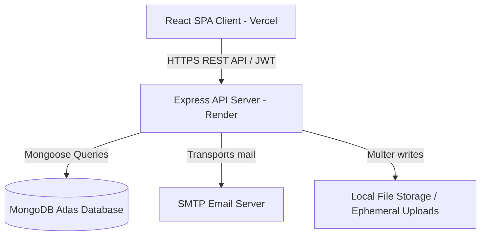
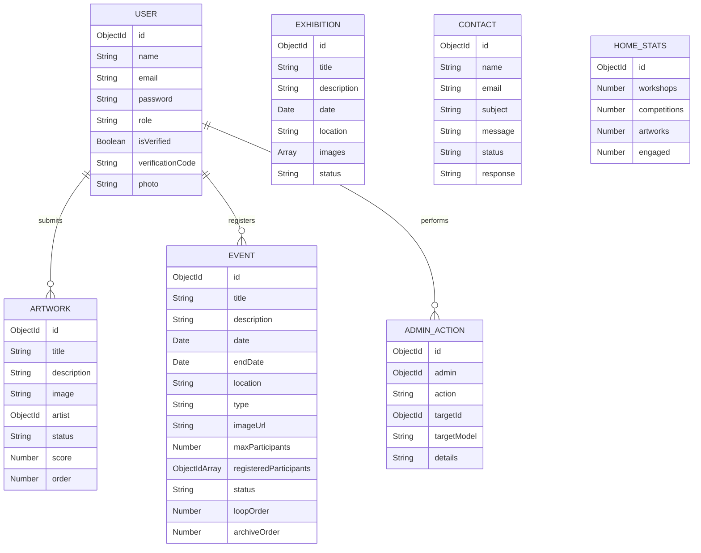

# Architecture Overview

This document outlines the software architecture, database design, and security flows of the Palette Art Club portal.

---

## High-Level System Architecture

The application is structured as a decoupled **Client-Server Architecture** (Monorepo). The client is a single-page React application compiled using Vite and hosted on Vercel, and the backend is a Node.js + Express REST API hosted on Render. MongoDB Atlas is used for database storage.

---

## Component Architecture

### 1. Frontend (client/)
Built using a modern React system using Vite:
- **Routing**: `react-router-dom` handles page routing. An animated routing component (`AnimatedRoutes` in `App.tsx`) handles route-change transition animations.
- **State Management**: React Context (`AuthContext.tsx`) manages authenticated state, JWT storage, and current user details globally.
- **Styling**: Structured modular CSS. Each major page has its own dedicated `.css` stylesheet importing theme variables from `theme.css` and typography rules from `index.css`.
- **Animations**: Complex visual indicators, counters, and scroll fades are handled by `framer-motion`.
- **API Client**: Axios instance (`api.ts`) configured with a request interceptor that automatically attaches the user's JWT from `localStorage` in the `Authorization` header.

### 2. Backend (server/)
Built as a standard modular REST API:
- **Routes**: Router mounts (`server/src/routes/`) handle HTTP mapping.
- **Controllers**: Controller logic (`server/src/controllers/`) processes data and formats JSON responses.
- **Middlewares**: Middleware layers handle common routines:
  - `authMiddleware.ts`: Verifies JWT tokens and checks user clearance (`admin` or `user`).
  - `multerConfig.ts`: Handles multipart file uploads (artwork image files, profile pictures, event posters).
- **Database Layer**: Mongoose schemas and models (`server/src/models/`) define the document structure.

---

## Database Schemas & Data Model

We use MongoDB as our document store. Below is an overview of the key data schemas managed by Mongoose.

### Core Schema Descriptions
- **User**: Holds login credentials, verification state (via OTP numeric code), and user profile pictures.
- **Artwork**: Tracks user-submitted drawings or paintings. Features an approval pipeline (`pending`, `approved`, `rejected`), custom display orders, and evaluation scores given by admins.
- **Event**: Manages club workshops, competitions, and generic events. Supports date ranges, participation capacity, registered users tracker, and home-page pin orders (`loopOrder`, `archiveOrder`).
- **Exhibition**: Curates digital exhibitions. Contains metadata and an array of artwork items (URL, title, artist).
- **AdminAction**: Audit log schema documenting administrative operations (who approved which artwork, created an event, or promoted a user).

---

## Security & Authentication Flow

1. **Email Verification**: When a user registers, they are in a pending verification state (`isVerified: false`). A numeric code is generated and dispatched to their email (via nodemailer). They must enter this code to activate their account.
2. **JWT Sessions**: On login, a JSON Web Token is signed using the server's `JWT_SECRET`. The client stores this token in `localStorage`.
3. **Route Protection**: Private routes use the `protect` middleware to decode the JWT and attach the user record to the request.
4. **Role Enforcement**: Administrative endpoints are secured with `authorize('admin')` to block unauthorized users.
